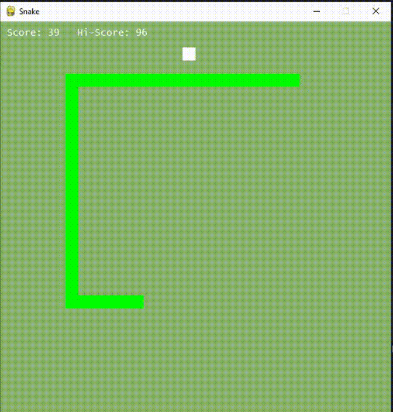

# Snake Game

Welcome to the classic Snake game implemented in Python using the Pygame library!



## Table of Contents
- [Description](#description)
- [Features](#features)
- [How to Play](#how-to-play)
- [Dependencies](#dependencies)
- [Installation](#installation)
- [Usage](#usage)
- [Customization](#customization)
- [Orignal Music](#original-music)
- [High Score](#high-score)
- [License](#license)
- [Acknowledgments](#acknowledgments)

## Description

This Snake game is a simple and nostalgic implementation of the popular Snake game. The game is built using Python and the Pygame library, providing a fun and engaging experience for users.

## Features

- Classic Snake gameplay with a nostalgic touch.
- Dynamic music and background changes as you progress through different score levels.
- High score tracking to challenge yourself and beat your best score.
- Colourful and responsive interface.

## How to Play

- Use the arrow keys to control the snake's direction (Up, Down, Left, Right).
- Eat the white square (food) to grow the snake and increase your score.
- Avoid running into the snake's own body or the game boundaries.
- The game ends when the snake collides with itself or the boundaries.

## Dependencies

- Python 3.x
- Pygame library

## Installation

1. Clone the repository:

   ```bash
   git clone https://github.com/yourusername/snake-game.git
   cd snake-game
   ```
   
2. Install the required dependencies:

   ```bash
   pip install pygame
   ```

## Usage

Run the game using the following command:

```bash
python snake_game.py
```

## Customization

Feel free to customize the game by modifying the code. You can adjust variables such as snake_speed, snake_block, and even add your own music tracks.

## Orignal Music

This game has original music made by the author.

## High Score

The game tracks your highest score, and it will be displayed each time you play. The high score is stored in the highscore.txt file.

## License
This project is licensed under the MIT License.
